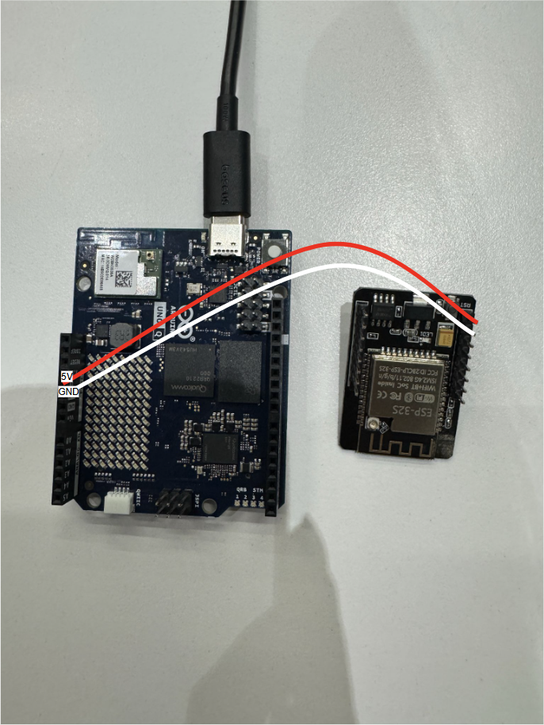

# DecoAI Assistant

An event-decoration assistant for **Windows on Snapdragon X Elite**. It runs an
OpenClaw agent that generates decor concepts on the device's Hexagon NPU, counts real
shelf stock through an Arduino Uno Q camera, prices a chosen concept against a shared
inventory database, and sends the owner a shopping list.

Most of the work happens locally: Stable Diffusion 2.1 and Qwen2.5-VL-7B-Instruct both
run on the NPU, and the inventory database is a plain SQLite file. Only the cloud image
backend (Cirrascale) and the agent model (Claude, via Anthropic) need the network.

---

## What it does

The owner asks for decor ideas in chat. The agent replies with **three concept
images** — one rendered locally on the NPU, two from Cirrascale — and asks which to
build. Once one is picked, a single call detects the items in that image, checks them
against stock, prices what is missing, builds Amazon links, and pings the owner on
Telegram. Separately, pointing the Uno Q camera at the shelf refreshes the database
from what is actually on it.

| Skill | What it does |
|-------|--------------|
| `image-generation` | Three-image concept sets: 1 local SD2.1 on the NPU, 2 on Cirrascale SDXL |
| `inventory-management` | Invoice intake, photo stock-checks, shelf refresh, and a guarded DB wipe |
| `cost-estimation` | Prices have-vs-need per item from the shared database |
| `unoq` | Captures the shelf on an ESP32-CAM and counts it with Qwen3.5-2B (llama.cpp) on the Uno Q |
| `amazon-url-builder` | Turns a missing-items list into Amazon purchase links |

Each skill also ships a CLI you can run directly, without going through the agent —
useful for testing a service in isolation or scripting around it. See
[Skill CLIs](#skill-clis) below.

---

## Requirements

**Hardware.** A Snapdragon X Elite machine running Windows 11 on ARM64. The Arduino
Uno Q and ESP32-CAM are optional — without them, shelf refresh falls back to an HTTP
service or generated data.

**Software.** `setup.ps1` installs all of this for you through winget and npm, so you
normally only need winget present:

- Node.js 22 or newer
- Python 3.12 **and** 3.13, both native ARM64
- Git and Android platform-tools (`adb`)
- `openclaw` and `geniex`, installed globally via npm

**Python packages.** Each skill has its own `requirements.txt`, installed into its own
virtualenv by setup (see [What setup does](#what-setup-does)). The `image-generation`
CLI, for example, only needs `httpx>=0.27` and `python-dotenv>=1.0` — the heavier
`onnxruntime-qnn`/diffusers stack lives in the separate SD2.1 pipeline environment.

**Node packages.** `amazon-url-builder` is a small Node service (`src/server.js`) with
one dependency, `amazon-url-builder`, installed via `npm install` during setup.

**Not included in this repo.** The precompiled Stable Diffusion 2.1 QNN package is
several GB and is distributed separately. It is a single flat folder holding seven
files:

```
metadata.json
text_encoder.onnx      text_encoder_qairt_context.bin
unet.onnx              unet_qairt_context.bin
vae.onnx               vae_qairt_context.bin
```

The `.onnx` files are thin wrappers and the `.bin` files hold the compiled NPU graphs,
so both halves must stay together. Drop that folder into a `models` directory — either
beside `setup.ps1` or in the OpenClaw workspace — and setup finds it on its own;
otherwise it asks for the path. `start.ps1` checks the same places, so adding the model
later works without re-running setup.

Skipping it is fine. Everything else still works, and cloud image generation covers the
gap until you add it.

**Geniex and the vision model.** `setup.ps1` installs the Geniex CLI for you
(`npm install -g geniex`), but it does not pull the vision-language model — that comes
from Qualcomm AI Hub and has to be fetched once, separately:

1. Go to [Qualcomm AI Hub](https://aihub.qualcomm.com/compute/models) and search for
   **Qwen2.5-VL-7B-Instruct** (or open its page directly:
   <https://aihub.qualcomm.com/models/qwen2_5_vl_7b_instruct>). Filter by chipset
   **Snapdragon X Elite** and runtime **GenieX - QAIRT** if it isn't preselected.
2. Open the model's **Quick Start** tab. For Windows on Snapdragon X Elite it gives you
   a Geniex CLI installer for Windows ARM
   (<https://qaihub-public-assets.s3.us-west-2.amazonaws.com/qai-hub-geniex/geniex-cli.exe>)
   and a one-line command to run the model:
   ```
   geniex infer ai-hub-models/Qwen2.5-VL-7B-Instruct
   ```
3. Run that command once geniex is installed. Geniex resolves and downloads the model
   itself — there's no separate model-file folder to place by hand, unlike the SD2.1
   package above. `GENIEX_MODEL` in `.env` should match the model id you ran
   (`ai-hub-models/Qwen2.5-VL-7B-Instruct` is the default).
4. `start.ps1` starts the Geniex service on port 18181 for you afterwards; you don't
   need to keep the `geniex infer` command running yourself.

   If you downloaded the model bundle by hand instead (an AI Hub `.zip`) rather than
   letting `geniex infer` fetch it, register it with `geniex pull` instead — it accepts
   the zip directly, no manual unzip needed:

   ```powershell
   geniex pull local/qwen2.5-vl --local-path C:\downloads\qwen2_5_vl_7b_instruct.zip
   geniex infer local/qwen2.5-vl
   ```

   Unzipping it yourself first works too — point `--local-path` at the extracted folder
   instead of the `.zip`. Either way, once `geniex pull` finishes caching it you can
   delete the original download; `geniex list` confirms it's cached.

Skipping this is also fine — decoration-photo analysis just falls back to whatever
cloud endpoint is configured via `IMAGE_READ_MODEL_URL`, or mock data if that's blank
too.

**API keys.** `ANTHROPIC_API_KEY` for the agent itself and `CIRRASCALE_API_KEY` for
cloud images. Telegram notifications need a bot token and chat id. Anything left blank
degrades to mock data rather than failing — this applies to invoice reading, photo
analysis, shelf counting, and price lookups alike, each of which has its own optional
model/API-key triplet (see [Configuration](#configuration)).

---

## Setup

### 1. Get the code

```powershell
git clone https://github.com/amishap04/DecoAI-Assistant.git
cd DecoAI-Assistant
```

### 2. Add your keys

```powershell
copy .env.example .env
notepad .env
```

Fill in `ANTHROPIC_API_KEY` and `CIRRASCALE_API_KEY` at minimum. Leave every path
variable blank — setup fills those in from the directory you choose in the next step.
Values are read literally: do not quote them, and do not put a comment on the same line
as a value.

### 3. Run setup

```powershell
.\setup.bat
```

It requests administrator rights (winget needs them) and then walks through the whole
install. It asks two questions: where to put the data directory, and where your SD2.1
model package lives. Press Enter to accept the defaults or skip.

Expect it to take a while the first time — the ARM64 wheels for `onnxruntime-qnn` and
the model copy are the slow parts.

To skip the prompts entirely:

```powershell
.\setup.bat -DataRoot D:\DecoAI -ModelBins D:\models\sd21_qnn -NonInteractive
```

### 4. Start everything

```powershell
.\start.bat
```

This brings up all four services, waits for each to accept connections, and then tails
the gateway log. Open <http://127.0.0.1:18789> for the control UI. Press Ctrl+C to shut
everything down.

### 5. Try it

Open the control UI (or wherever the agent is wired to chat — Telegram, once
`TELEGRAM_BOT_TOKEN`/`TELEGRAM_OWNER_CHAT_ID` are set) and ask for something like:

> "Decorate my home for a blue and gold birthday party."

The agent should come back with three concept images. Pick one, and it will run item
detection, check inventory, and reply with a priced shopping list.

---

## What setup does

It installs the prerequisites, then configures OpenClaw in `%USERPROFILE%\.openclaw`:
skills and system prompts are deployed into the workspace, and a runtime
`openclaw.json` is written with your paths, a freshly generated gateway token, and any
keys from your `.env`.

Everything large or machine-specific goes in the **data directory** you choose, not in
the repo:

```
<data root>\
  models\stable-diffusion-2-1\Model_Bins\   the SD2.1 QNN package
  outputs\                                  generated concept images
  camera-frames\                            frames pulled from the Uno Q
  database\decoai.sqlite                    the shared inventory database
  venvs\decoai-py313\                       skill CLIs
  venvs\sd21-py312\                         the SD2.1 NPU pipeline
  hf-cache\                                 CLIP tokenizer download
  logs\                                     one log per service
```

The two output folders are linked back into the workspace as directory junctions, so
workspace-relative paths like `Skills/image-generation/output/concept_1.png` keep
working while the bytes land on your data drive.

Setup also **rewrites the hardcoded paths** baked into the skills on the original build
machines, and points the agent's `exec:` commands at the Python 3.13 virtualenv rather
than a bare `python`. Finally it records the resolved layout in `decoai-setup.json`,
which is what `start.ps1` reads. That file is machine-specific and git-ignored.

Setup is safe to re-run. The usual reason to do so is adding an API key: put it in
`.env` and run `.\setup.bat` again to push it through to the workspace.

---

## Services

`start.ps1` launches these in order and waits for each one:

| Port | Service | Notes |
|-------|---------|-------|
| 50002 | SD2.1 session server | Holds the pre-loaded ORT-QNN sessions. First start takes a minute or two |
| 8004 | Amazon URL builder | Node service that builds purchase links |
| 18181 | Geniex | Qwen2.5-VL-7B-Instruct on the NPU, for reading decoration photos |
| 18789 | OpenClaw gateway | The agent and its control UI |

Anything unavailable degrades rather than blocking: no model package means the NPU
image is skipped, no `geniex` means photo analysis falls back to a cloud model. Only the
gateway is required — if it cannot start, `start.ps1` stops.

Useful flags: `-NoSd21`, `-NoGeniex` and `-NoAmazon` skip individual services, and
`-SessionServerOnly` runs just the SD2.1 server in the foreground when the gateway is
already running elsewhere.

---

## Skill CLIs

Every skill has a CLI under `Skills/<skill>/cli/` (or the skill root, for
image-generation and unoq) that the agent calls under the hood. They're safe to run
directly for testing.

### image-generation — `generate_cli.py`

```
decoai-generate-image "<prompt 1>" ["<prompt 2>" "<prompt 3>"] [options]
```

Prompt 1 is rendered locally on SD2.1 (keep it short and concrete); any additional
prompts go to Cirrascale SDXL. Notable flags: `--n` (total images in the set, clamped
to a max), `--no-local` (skip the NPU image, run every image on Cirrascale), `--model`,
`--size`, `--seed`, `--output-dir` (workspace-relative by default), and `--timeout`
(cold-start cloud calls can take 15-60s).

### inventory-management — four CLIs under `cli/`

**`invoice_cli.py`** — reads an invoice image or PDF into inventory:

```
decoai-invoice <invoice-file> [--json]
decoai-invoice <invoice-file> --extract-only
decoai-invoice --commit-file <path> [--json]
```

The one-shot form extracts and commits without ever setting `rent_ea`. The two-step
form (`--extract-only`, then judge each item's rentability, then `--commit-file`) is
the recommended path so reusable decor and one-time consumables get priced correctly.

**`image_cli.py`** — analyzes a decoration photo, checks detected items against stock,
and reports present/partial/missing per item.

**`refresh_cli.py`** — syncs shelf counts from the Uno Q (or falls back to
`ARDUINO_URL` / dummy data):

```
decoai-refresh [--json] [--dry-run] [--unoq] [--dummy] [--reorder-only]
decoai-refresh --commit-file <ask_vlm-reply.txt|->
```

`--dry-run` shows what would change without touching the DB. `--unoq` forces real
board counts and fails instead of silently falling back. `--reorder-only` emits just
the reorder JSON array, which is what feeds `amazon-url-builder`. Exit code 1 means the
Uno Q / Arduino was unreachable.

**`clear_cli.py`** — wipes all inventory rows, with an automatic backup first. Only for
explicit owner request; described in the skill docs as destructive and irreversible
except from that backup.

### cost-estimation — `estimate_cli.py`

```
decoai-estimate <items-json> [--json]
decoai-estimate --file <items.json> [--json]
```

`<items-json>` is a JSON array of `{"item_name": str, "color"?: str, "quantity"?: int}`.
Output includes `needed`/`in_stock`/`missing`/`cost_ea`/`line_cost` per item and a
DB-only `total_cost` — pricing for items with no DB cost has to be sourced separately
and isn't folded into that total. Exit code 1 means bad input.

### unoq — capture and count on the Uno Q

```
shelf_counts.py [--mode auto|items|bins] [--bins "A1=red balloon,A2=gold streamer"]
                [--image PATH | --latest] [--save [PATH]] [--raw]
```

`--capture-only` grabs a frame, saves it, and stops (no VLM call) so it can be reviewed
before counting. `--latest` re-uses the frame already on the board instead of
capturing a new one — the standard workflow is capture-and-show first, then count that
exact frame, never re-capturing in between. Exit codes: `0` success, `1` board/VLM
failure, `2` reply not parseable, `3` the VLM saw nothing in the frame. Counting takes
1–3+ minutes; that's normal, not a hang.

### amazon-url-builder

Node service (`src/server.js`) started on port 8004 by `start.ps1`; takes a
missing-items list and returns Amazon search URLs, optionally tagged with
`AMAZON_AFFILIATE_TAG`.

---

## Using the Uno Q camera



The camera path needs the board connected over USB with its VLM running:

```powershell
adb devices                       # the Uno Q must be listed
adb shell 'bash ~/start_vlm.sh'   # start Qwen3.5-2B (llama.cpp) on the board
```

Then ask the agent to check the shelf. It captures a frame, shows it to you, and counts
that same frame — so you can see what the numbers came from. Counting takes one to
three minutes on the board; that is normal. A `RemoteDisconnected` error means the VLM
service isn't running on the board — re-run `start_vlm.sh`.

Without the board, shelf refresh uses `ARDUINO_URL` if set, and generated counts
otherwise.

---

## Configuration

Every setting lives in `.env`; `.env.example` documents each one. The file you edit at
the repo root is the template. Setup merges it with the paths it resolves and writes the
real runtime file to `<workspace>\Skills\.env`, which is what the skills load. Your
`.env` is git-ignored, so keys never reach the repo.

**Paths** (leave blank — filled in by `setup.ps1`): `DECOAI_DB_PATH`,
`DECOAI_OUTPUT_DIR`, `SD21_MODEL_DIR`, `SD21_PYTHON`, `HF_HOME`.

| Variable | Purpose |
|----------|---------|
| `ANTHROPIC_API_KEY` | The agent model. Required |
| `CIRRASCALE_API_KEY` | Cloud image generation. Required for concepts 2 and 3 |
| `INVOICE_READ_MODEL_URL` / `_MODEL_NAME` / `_API_KEY` | OpenAI-compatible endpoint for reading invoices; falls back to Anthropic, then mock data |
| `IMAGE_READ_MODEL_URL` / `_MODEL_NAME` / `_API_KEY` | Same fallback pattern for decoration-photo analysis. Set the URL to `http://127.0.0.1:18181/v1` to route to local Geniex |
| `GENIEX_MODEL` | The vision model Geniex serves — defaults to `ai-hub-models/Qwen2.5-VL-7B-Instruct` |
| `UNOQ_SCRIPT` | Path to the Uno Q counting script; auto-filled by setup |
| `UNOQ_TIMEOUT_SECONDS` | Default `900` — generous, since VLM counting is slow |
| `ARDUINO_URL` | HTTP shelf-counting service, used when the Uno Q is not attached |
| `REORDER_THRESHOLD` | Default `5` — stock at or below this count is flagged for reorder |
| `REFRESH_INTERVAL_SECONDS` | Default `300` — polling interval for scheduled refreshes |
| `SERPAPI_KEY`, `PRICE_LOOKUP_URL`, `PRICE_PREDICT_MODEL_URL` / `_MODEL_NAME` / `_API_KEY` | Optional price lookup/prediction backends; unused today since pricing comes from the inventory DB |
| `AMAZON_AFFILIATE_TAG` | Appended to purchase links if set |
| `AMAZON_BUILDER_PORT` | Default `8004` |
| `TELEGRAM_BOT_TOKEN`, `TELEGRAM_OWNER_CHAT_ID` | Both required together to enable Telegram notifications |
| `DECOAI_INSECURE_SSL` | Default `false` — only set `true` for self-signed-certificate endpoints |

### Setting up the Telegram bot

`TELEGRAM_BOT_TOKEN` comes from Telegram's own bot-creation flow, not from this repo:

1. Open Telegram and search for **@BotFather** (or go to <https://telegram.me/BotFather>).
2. Start a chat with it and send `/start` to see the available commands.
3. Send `/newbot` and follow the prompts to choose a display name and a unique
   username (must end in `bot`, e.g. `DecoAIAssistantBot`).
4. BotFather replies with a token that looks like `123456789:AAExampleTokenValue`.
   Paste that into `TELEGRAM_BOT_TOKEN` in your `.env`.
5. You still need `TELEGRAM_OWNER_CHAT_ID` — the chat DecoAI should notify. Message
   your new bot once (anything, e.g. `/start`), then look up its chat id by opening
   `https://api.telegram.org/bot<TELEGRAM_BOT_TOKEN>/getUpdates` in a browser and
   reading the `"chat":{"id": ...}` field from the JSON response. Put that number in
   `TELEGRAM_OWNER_CHAT_ID`.
6. Save `.env` and re-run `.\setup.bat` so the token reaches the workspace (setup is
   safe to re-run — see [What setup does](#what-setup-does)).

Both variables must be set together; leaving either blank disables Telegram
notifications entirely rather than failing.

---

## Repository layout

```
setup.ps1 / setup.bat        one-time install
start.ps1 / start.bat        launch every service
.env.example                 configuration template
Skills/
  image-generation/          generate_cli.py, SD2.1 pipeline, output/
  inventory-management/      cli/ (invoice, image, refresh, clear), app/
  cost-estimation/           cli/estimate_cli.py, app/ (FastAPI — do not call directly)
  unoq / UnoQ-ESP32-VLM/     scripts/ (pull_latest, shelf_counts, ask_vlm, refresh_cli,
                              deploy_to_unoq.sh, setup_qwen_vlm.sh, start_vlm.sh)
  amazon-url-builder/        Node service, src/server.js
  database/                  db.py, models.py, matching.py, schema.sql — shared by
                              inventory-management and cost-estimation
System/                       agent system prompts and the OpenClaw config template
```

`System/openclaw.runtime.json` is the template for the config that setup deploys to
`%USERPROFILE%\.openclaw\openclaw.json`; its double-underscore placeholders are filled
in at install time. `System/openclaw.json` is the reference copy of the original config
and is not used at runtime.

The shared database is a single SQLite file with one `items` table: `id`, `item_name`,
`color`, `cost_ea`, `rent_ea`, `quantity` (kept in sync by the Uno Q vision system),
`last_purchased`, `bin_id` (physical shelf location, also tracked by the Arduino), and
`updated_at`. It's indexed on `bin_id` and `item_name`, and is the single source of
truth for both `inventory-management` and `cost-estimation` — always go through their
CLIs rather than editing rows or calling internal FastAPI routes directly.

---

## Troubleshooting

**`winget` is not recognised.** Install App Installer from the Microsoft Store, or
install Node, both Pythons and adb by hand and re-run with `-SkipPrereqs`.

**A virtualenv reports `AMD64` instead of `ARM64`.** You have x64 Python installed.
`onnxruntime-qnn` cannot reach the Hexagon NPU from it. Install the ARM64 build of
Python 3.12 and 3.13, delete the `venvs` folder in your data directory, and re-run
setup.

**Local image generation fails but cloud works.** Either the model package is missing —
check that `metadata.json` is in
`<data root>\models\stable-diffusion-2-1\Model_Bins\` — or the session server is not
up. Look at `logs\sd21-session-server.log`.

**`openclaw is not on PATH`.** The global npm install did not take. Run
`npm install -g openclaw` and start again.

**Photo analysis always falls back to cloud/mock, never uses the NPU.** Geniex is
installed but the model was never fetched. Run
`geniex infer ai-hub-models/Qwen2.5-VL-7B-Instruct` once (see
[Requirements](#requirements) for the AI Hub steps) so Geniex has the model cached,
then restart with `.\start.bat`.

**Port 18789 is already in use.** Another gateway is running. Stop it before starting a
new one; `start.ps1` refuses rather than fighting over the port.

**Shelf counts come back as dummy data.** The board is not reachable. Check
`adb devices` and that the VLM is running on it (`RemoteDisconnected` means the VLM
service isn't up — re-run `start_vlm.sh` on the board).

**Vision calls seem to hang.** They aren't — both the Geniex photo-read and the Uno Q
shelf count can legitimately take one to several minutes. Don't retry or kill the
process; wait for `UNOQ_TIMEOUT_SECONDS` (default 900s) to elapse if something is
actually stuck.

Each service writes its own log to the `logs` folder in your data directory; that is the
first place to look when something starts but misbehaves.

---

## Known Gaps

**Voice interaction is scaffolded but disabled.** A `whisper-node-bridge` plugin is
registered in the OpenClaw config alongside Telegram, but it's turned off, and the
agent's own instructions make no mention of voice, speech, or audio input. Enabling it
is plumbing, not a rebuild — but it isn't live today.

## Future Work

- Turn on and wire up the existing `whisper-node-bridge` plugin for voice interaction
- Real-time warehouse inventory detection and automatic updates from continuous camera
  feeds, rather than on-demand refresh
- Improved material quantity estimation
- Personalized decoration recommendations and budget-constrained design generation
- Automatic comparison of generated designs by price
- Direct retailer APIs beyond Amazon search links, and autonomous purchasing workflows
- Multi-user decorator dashboards
- Additional edge AI devices and expanded on-device inference
- End-to-end event planning beyond decorations

---

## License

MIT. See [LICENSE](LICENSE).
